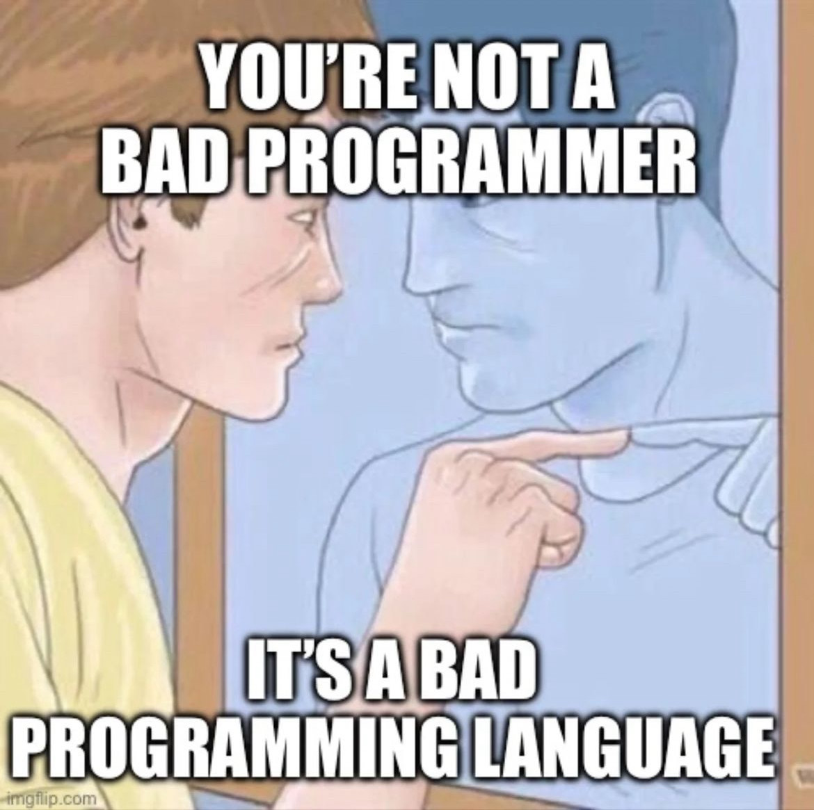

# Millum KATA

Dette repoet består av kodeutfordringer brukt hos Millum


## Up and running

Kjør npm install for å komme i gang

```bash
npm i
```

## How to

Finn kataene i mappen /katas

Filnavnene heter <tall>\_navn.ts
Dette for å gi en slags rekkefølge

For å teste din implementasjon, start testene for din valgte kata på kommandolinjen

scriptene for å teste filene heter test:<oppgavenavn>

Skal du prøve deg på for eksempel 1_filter_users vil du kjøre scriptet

```bash
npm run test:filter-users
```

OBS OBS Legg merke til at i scriptene er understrek byttet ut med bindestrek

Testene for din valgte kata starter, og vil kjøre på nytt hver gang du lagrer filen du jobber i

## Success

Idet testene dine melder grønt anses oppgaven som løst


